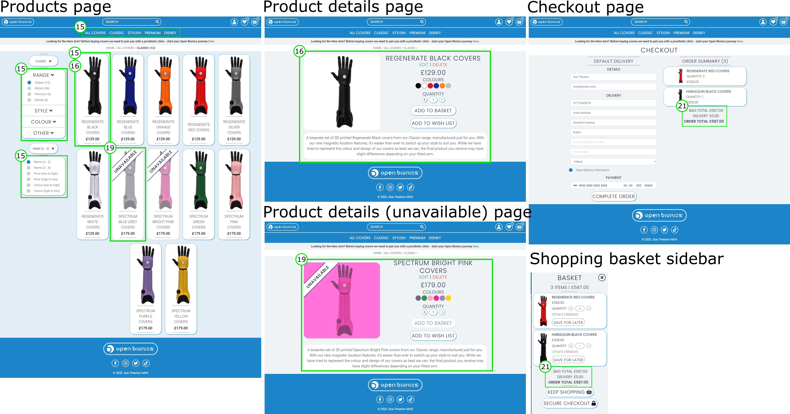
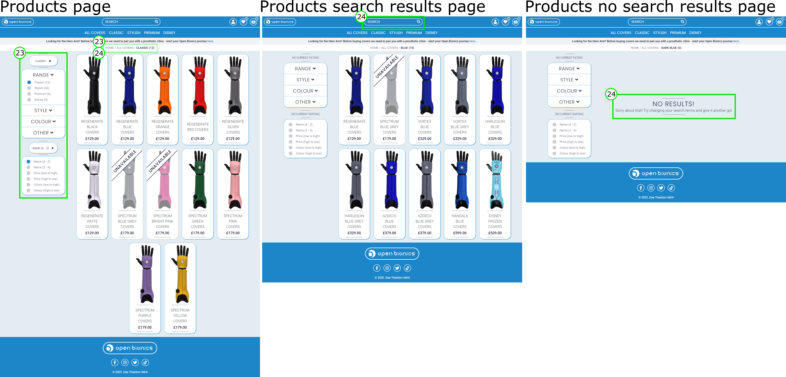
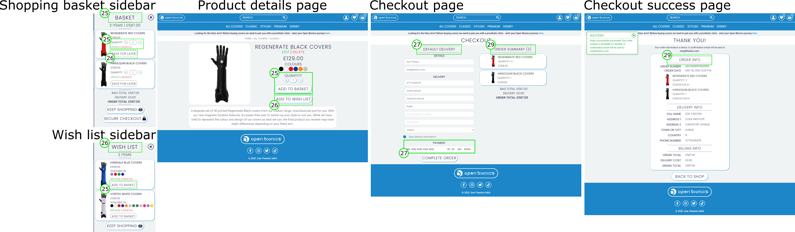
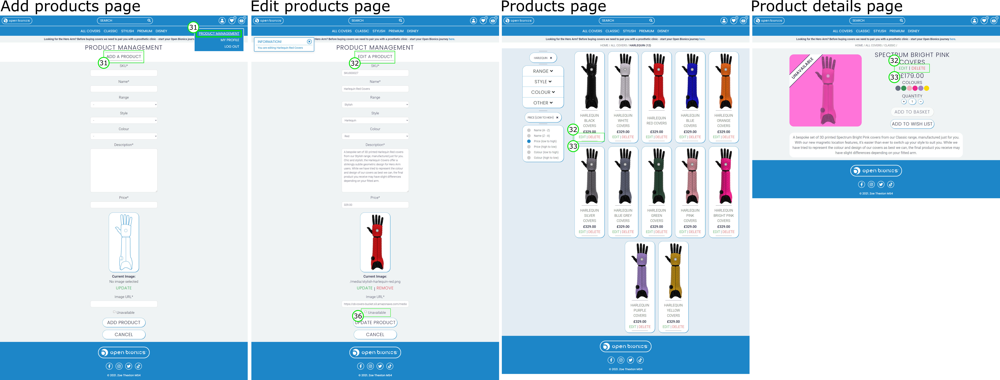

# Open Bionics Covers - Testing

## Table of Contents

- [Testing During Development](#testing-during-development)
- [Known Bugs](#known-bugs)
- [Code Validation](#code-validation)
    - [HTML](#html)
    - [CSS](#css)
    - [JavaScript and JQuery](#javascript-and-jquery)
    - [Python](#python)
    - [Responsiveness](#responsiveness)
    - [Browser Compatibility](#browser-compatibility)
    - [Accessibility](#accessibility)
    - [Performance](#performance)
- [Automated Testing](#automated-testing)
- [Testing User Stories](#testing-user-stories)

Click **[here](readme.md)** to return to the main document.

## Testing During Development
Throughout the development process I used the console.log() function to test my JavaScript and the print() function to test my Python and identify any unpredictable behaviour. Almost all of the bugs I found were down to typos in the code, but three errors took longer to fix:
- **628e0fa** - A missing  at the top of my checkout_order_summary.html was causing a 500 error on my deployed site and a template syntax error on my development site. I had added it to the top of my main checkout.html page, but didn't realise that you had to apply it in subsequent includes files as well.
- **dd7ee61** - After deploying to Heroku I noticed that the images on my development site didn't match those on my live site. After combing through the code for a full two days, I realised that I had changed the data on the MySQL database but not on the Postgres database which was an easy fix.
- **afeaa1e** - Users can adjust the quantity of items from the product detail page and from the sidebar shopping basket - because the shopping sidebar is always available from every page this meant that when the product detail page was open there were two identical IDs controlling the quantity value, resulting in one of the quantity inputs not working properly. I resolved this by adding a second JavaScript function to control the quantities in the shopping basket.

## Known Bugs
- The race condition between the order form and the webhook handler occasionally creates duplicate orders for the user - when the order isn't created quickly enough by the form the webhook handler assumes an error has occurred and creates the order based on the webhook from Stripe, but then soon after the form finishes processing and creates the order again. This could be fixed by increasing the number of attempts in the `handle_payment_intent_succeeded` function or the delay between attempts, but this would potentially slow down the checkout process (and wouldn't guarantee that this bug would be eliminated!) I discovered this bug very close to my submission deadline so didn't have time to fix it but in the event Open Bionics opt to use my site fixing this bug would be a priority.
- Currently when a product is deleted from the inventory it will be removed from any order confirmations that had a quantity of that product in it. While this is not user friendly, deleting the product does not cause the site to crash so I decided it was out of the scope of the project to fix this. In the event Open Bionics opt to use my site, fixing this bug would be a priority.
- There is a small visual bug on the products menu on desktops - the user can scroll the filter menu past the footer. I ran out of time to fix this, but the menu retains its functionality so I didn't think it was critical to fix for project submission.

## Code Validation

### HTML
I used the W3C Markup Validation Service to validate my HTML. The main error that it flagged up was on my products.html page. I wanted to use the same block of code to control the filter and sorting menus on mobile and desktop devices, but I wanted it to appear in a pop-up modal on mobiles and a side menu on desktops. I included the same block of code to avoid repetition, one in the modal and one in the side menu, and applied "display:none" styling to the relevant block at the relevant breakpoint. However, even though the block was only displaying once the IDs for all of the elements inside the menus were rendering twice - this threw up an error in the validator and was also preventing my onload animation on the products.html page from working properly. I ended up installing the django-user-agents package which allows you to wrap HTML in conditional breakpoint tags to prevent the HTML from rendering on specific devices. This eliminated all of the errors on the products.html page. The remaining warnings on the site could be eliminated by improving the semantic markup - this is something I hope to improve upon in the next iteration of the site.

### CSS
I used the W3C CSS Validation Service to validate my CSS. No errors were found.

### JavaScript and JQuery
I used JSHint to test my JavaScript functions. The main errors that it flagged were removing the `type` from the `script` tags and adding `// jshint esversion: 6` in a comment at the top of any code that used template literals. Apart from that there were a few missing semicolons and some un-used variables that have now been removed.

### Python
I used PEP8Online and the Gitpod Problems terminal to test my Python code. The majority of the problems were E501 "Line Too Long" warnings which have almost all been resolved, excluding those present in the migrations files. There are four remaining warnings present in the main settings.py file which I couldn't get rid of without breaking up a long variable name.

### Responsiveness
I used Google Developer Tools and Amiresponsive.com to test the responsiveness of my site. My 20 colleagues who reviewed the site also used a variety of phones, tablets and desktops to view the site. There were a few visual bugs that were resolved before project submission.

### Browser Compatibility
I have tested the site on Chrome, Safari and Mozilla. My 20 colleagues who reviewed the site also used a variety of browsers to view the site. No errors were found.

### Accessibility
I used the Lighthouse feature on Google Developer Tools to test the accessibility of my site. it gave a score of around 90 across the site and didn't flag any major issues so I decided that was good enough for submission. In the next iteration of the site I would want to improve on the semantic markup in the HTML and improve the contrast of the navbar elements.

### Performance
I used the Lighthouse feature on Google Developer Tools to test the performance of my site. My 20 colleagues who reviewed the site also scored the site for performance - it got an average of 8.1. Initially it had a very low Lighthouse score of 25 - 40 across the site which wasn't good enough for submission. All of my product photos were much larger than they needed to be - I resized them and reuploaded them as JPGs instead of PNGs which increased my score to 75 - 85 across most of the site, but still a low score of around 50 on the index.html page. This is because of the way the cover swatches are generated - the Python function that generates them needs to query the database in order to make sure they have the correct amount of colours and the correct images attached to them. Because of this querying, the initial response time of the index.html is quite slow. I didn't want to get rid of the cover swatches pre-submission because I think they add a lot to the UX of the site, but in future iterations of the site I would want to improve the efficiency of the code. I would also try to increase the score across the rest of the site by reworking the structure of the DOM to improve the speed index and reduce time until first meaningful content paint.

## Automated Testing
I also took advantage of the Django testing framework to write various automated tests to check that my views were working correctly. The Coverage report produced towards the tail-end of development shows that 46% of my code is covered by my current tests - there is obviously a lot of room for improvement and this is something I would like to do in future iterations of the project.

## Testing User Stories
To finish my testing process I reassessed my User Stories to check that my site meets the criteria outlined at the beginning of the project. I have listed the stories below and used screenshots of the desktop site (where relevant) to illustrate how my site fulfils my original User Stories. I also shared the site with 20 of my colleagues at Open Bionics and asked them to score the site on "UX experience", "Performance", "Easy to use" and "Open Bionics branding" to get feedback on the more subjective User Stories and have included their feedback too.

_General_

1. _As the developer, I want to create a full-stack e-commerce platform where site users can browse and purchase products and where site owners can add, edit and delete products to complete the fourth_ Code Institute _Milestone Project._
    - _Open Bionics Covers_ allows its users to do all of the functionality in the above statement, thereby meeting all of the criteria laid out in the fourth Milestone Project criteria.
2. _As the developer, I want the website to function well to demonstrate my ability to code in JavaScript, Python and Django and to create a positive UX experience for the site users._
    - My Lighthouse performance score definitely has room for improvement - however, out of the 20 people surveyed it scored 8.1 for "Performance" indicating that this did not negatively impact their experience of the site. They also gave it a score of 9.8 for "UX experience" indicating that this user story has been successfully fulfilled.

_Aesthetic, Branding and UX_

3. _As the developer, I want the website to be aesthetically pleasing and easy to use to demonstrate my ability to code in HTML and CSS and to create a positive UX experience for the site users._
    - The consistent styling, colour scheme, CSS effects and page layout create a positive UX experience for the user. Out of the 20 people surveyed, it scored 9.8 for "UX experience" and 9.5 for "Easy to use".
4. _As the site owner, I want the aesthetic of the website to match our existing brand to adhere to our established brand identity._
    - The matching colour scheme, logos and product images adhere _Open Bionics Covers_ to the existing Open Bionics brand. Out of the 20 people surveyed, it scored 10 for "Open Bionics Branding".
5. _As the site owner, I want the site users to have a positive UX experience while browsing the product range to increase the likelihood of making a sale._
    - See User Story 3.
6. _As the site owner, I want to be able to advertise our cover product range and clearly present what we have in stock to our customer base to increase the likelihood of making a cover sale._
    - Users can browse the cover designs using the interactive swatches on the home page. There are several links that direct them towards the Products page where the product range is clearly presented to them. They can sort and filter using a range of criteria or search for a specific product in the navigation bar. Any unavailable products are clearly marked both on the main Products page and the Product Detail page.
7. _As the site owner, I want to promote our main product to increase the likelihood of making a Hero Arm sale._
    - There is a banner present on all pages informing the user about the Hero Arm with a link to the main website. There is also a large block of text with an image directing users back to the main website on the bottom of the home page.
8. _As a site user, I want feedback when I successfully/unsuccessfully complete an action on the website._
    - Users receive feedback on their actions through the toast messages. The text informs them of the feedback and the styling reinforces the message - green for success, blue for information and red for error.

_Registration and User Accounts_

9. _As a site user, I want to be able to easily register for an account._
    - The first thing a user sees on the Home page is a link to sign up for an account. They can also access this page through the dropdown profile menu. If they accidentally end up on the Log In page, there is a link that redirects them to the Sign Up page. Using the Django allauth add-on ensures that the registration process is reliable and secure.
10. _As a site user, I want to be able to easily log in and log out of my account._
    - The user can access the Log In page/Log Out link through the dropdown profile menu, depending if they are already logged in or not. If they accidentally end up on the Sign Up page, there is a link that redirects them to the Log In page. Using the Django allauth add-on ensures that the log in/log out process is reliable and secure.
11. _As a site user, I want to be able to recover my password and log in details if I’ve forgotten them._
    - The user can request a password reset from the Log In page if they have forgotten their details. They will then receive a link to reset their password through an email. Using the Django allauth add-on ensures that the password reset process is reliable and secure.
12. _As a site user, I want to have a personalised profile page so I can save my delivery details and see what I have ordered in the past._
    - The user can access their profile through the dropdown profile menu, where they can update their delivery details and see a summary of their order history. They can see a more detailed summary of each order by clicking on the specific order history tile.
13. _As a site user, I want to receive a confirmation email when I create a new account to confirm my details._
    - The user receives an automated confirmation email with their profile information after signing up. Using the allauth add-on ensures that the confirmation email process is reliable and secure.

_Viewing and Navigation_

14. _As the site owner, I want it to be easy for a site user to navigate to our main website in case they have come to OB Covers by mistake._
    - See User Story 7.
15. _As a site user, I want to be able to view a list of products to select some to purchase._
    - The user has the option of viewing "All Covers", "Classic", "Stylish", "Premium" and "Disney" through the main navbar options, or they can apply more specific filters/searches when on the Products page. The product tiles have a thumbnail of the design, the product name and the price - the thumbnails scale slightly when the user hovers over them, indicating that they can be clicked on to go to the Product Details page.
16. _As a site user, I want to be able to view specific product details (price, description) to inform my decision._
    - The user can click on specific products on the main Products page to access the specific Product Detail page. Here they can see the product name, price, available colours, description and links to add a specific quantity to the shopping basket or wish list.
17. _As a site user, I want to be able easily identify deals to take advantage of special savings._
    - In my scope I outlined this User Story as a "nice to have" feature. I didn't have time to include it in my site but it would be easy to implement in future versions using similar logic as the "unavailable" Boolean (see Readme - Information Architecture).
18. _As a site user, I want to be able to easily identify any "low stock" items so I can make my purchase before they run out._
    - See User Story 17.
19. _As a site user, I want to be able to easily identify any "out of stock" or "unavailable" items that I won’t be able to buy, so I don’t waste time trying to buy them._
    - "Unavailable" items are clearly identified on the product thumbnails and on the product detail pages. Users are unable to add them to their baskets; if a product becomes unavailable and is already in a user's basket the user will not be able to purchase it.
20. _As a site user, I want to be able to easily identify "newly added" products in case I am interested in purchasing them._
    - See User Story 17.
21. _As a site user, I want to be able to view my selection of products and see how much they will cost to avoid spending too much._
    - The user can see the sum of their selected products in their shopping basket, and in the order summary on the Checkout page. The number of items the user has in their shopping basket is also displayed in a small bubble above the icon on the navbar.

_Sorting and Searching_

22. _As a site user, I want to be able to customise my product to match my specific style._
    - In my scope I outline this User Story as a "nice to have" feature. I didn't have time to design the customiser but I would use the same JavaScript functions that I used for the interactive cover swatches in a future iteration of the site.
23. _As a site user, I want to be able sort products based on name, price, type, colour and brand._
    - The user can apply all of these filters to the product range. On mobile devices, the filter and sorting controls are in separate modals; on larger devices they appear on the side and scroll with the user. The breadcrumbs, current filter and current sorting summarise what filters they have applied. Users can easily reset the criteria by navigating back to "All Covers" using the navbar or by removing the filters on the filters/sorting menu.
24. _As a site user, I want to be able to search for products based on name and description._
    - The user can search for products using the search bar in the navigation menu. If their search is successful, they are redirected to the correct selection. If the search is unsuccessful, they are instructed to alter their search criteria and try again. The breadcrumbs summarise what search criteria they have applied.

_Purchasing and Checkout_

25. _As a site user, I want to be able to easily adjust the quantity of products from my shopping basket to reflect what I actually want to buy._
    - The user can alter the quantity of products to put in their shopping bag on the Product Details page, or if they change their mind later they can update the quantity or remove the item straight from the shopping basket. Items in the wish list can be "added to the basket" too.  The number of items the user has in their shopping basket is also displayed in a small bubble above the icon on the navbar.
26. _As a site user, I want to be able to save products that I might buy in the future but don’t want to buy immediately._
    - If the user doesn't want to buy a product immediately, they can save it into their wish list. From here they can add it into their bag, or remove it from their wish list. Items in the shopping basket can be "saved for later" into the wish list too.  The number of items the user has in their wish list is also displayed in a small bubble above the icon on the navbar.
27. _As a site user, I want to be able to easily enter my payment and delivery details so I can check out quickly with no hassle._
    - The user can enter their details on their profile and save them, or enter them at the checkout. Using the Stripe add-on ensures that the payment process is reliable and secure and will give the user confidence that their payment information is safe.
28. _As a site user, I want to be confident that my payment information is safe and secure._
    - See User Story 27.
29. _As a site user, I want to see an order confirmation after I pay to ensure I haven’t made any mistakes._
    - There is an order summary visible before the user pays so they can check their order. After a successful order, the user is taken to a summary of their purchase. They can access this again from their profile page if they need to.
30. _As a site user, I want to receive a confirmation email when I place an order to confirm my details._
    - After a successful order, the user is sent a confirmation email with a summary of their purchase.

_Admin_

31. _As a site owner, I want to be able to add products when we add new designs to our product range._
    - Admin users can add new products on the frontend of the website by clicking on the product management link in the profile dropdown menu, or through the admin backend.
32. _As a site owner, I want to be able to edit products when our product range changes._
    - Admin users can edit products on the frontend of the website by clicking the edit links visible on the product thumbnails or Product Detail pages, or through the admin backend.
33. _As a site owner, I want to be able to delete products when we remove them from our product range._
    - Admin users can delete products on the frontend of the website by clicking the delete links visible on the product thumbnails or Product Detail pages, or through the admin backend.
34. _As a site owner, I want to be able to temporarily mark products as "new" when new products are added to our range._
    - See User Story 17.
35. _As a site owner, I want to be able to temporarily mark products with deals if we are running a promotion._
    - See User Story 17.
36. _As a site owner, I want to be able to temporarily mark products as "unavailable" if there is an issue with supply._
    - Admin users can mark products as "unavailable" on the frontend of the website through the edit form, or through the admin backend.
37. _As a site owner, I want users to be unable to purchase "unavailable" products that we won't be able to fulfil._
    - See User Story 18.

