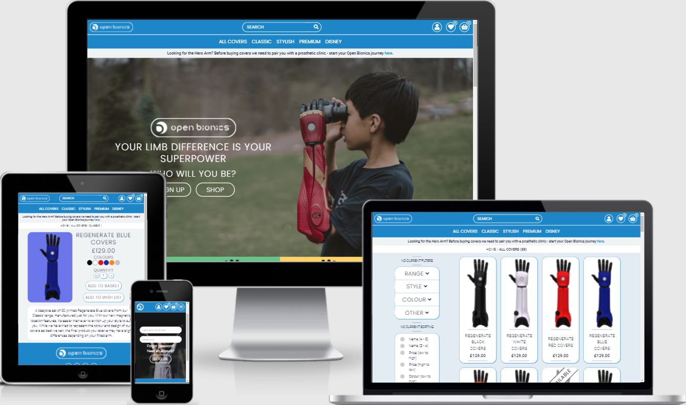
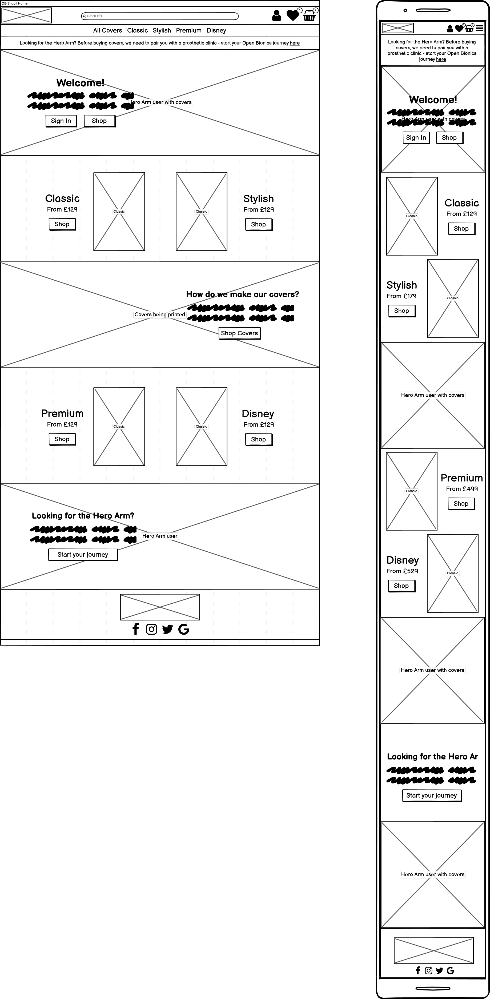
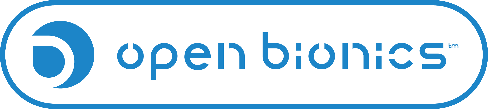

# OB Covers

## Code Institute: Milestone Project 4

I have worked for Open Bionics since 2016 - we are a medical engineering company that uses a combination of digital scanning and 3D printing to manufacture prosthetics. The main product - the Hero Arm - is a fully functional, bespoke prosthetic arm but our users can also customise their devices with a wide range of cover choices that come in different colours and styles. The current website that we use to sell covers hasn't been updated since 2018 and the backend is difficult to edit for anyone without software development knowledge - as a result, the user experience when using the website is poor, the product range is out of date and our cover sales are low. I wanted to develop a website - _OB Covers_ - with an easy-to-use backend that would make it easier for our customer base to purchase additional covers and hopefully boost cover sales.

This was the final of four Milestone Projects required to pass the Full Stack Web Development Program at _Code Institute_. The main requirements were to build a full-stack site based around business logic to control a centrally-owned dataset using HTML, CSS, JavaScript, Python and Django.

Click **[here](https://github.com/zoet24/ob-covers)** to view the Github repository for the project, and click **[here](https://ob-covers.herokuapp.com/)** to view the live website.

## Table of Contents

- [UX Design](#ux-design)
    - [Design Process](#design-process)
        - [Strategy Plane](#strategy-plane)
        - [Scope Plane](#scope-plane)
        - [Structure Plane](#structure-plane)
        - [Skeleton Plane](#skeleton-plane)
        - [Surface Plane](#surface-plane)
    - [Information Architecture](#information-architecture)
    - [Features and Django Apps](#features-and-django-apps)
        - [Existing features](#existing-features)
        - [Defensive design features](#defensive-design-features)
        - [Features left to implement](#features-left-to-implement)
- [Technologies Used](#technologies-used)
    - [Languages and frameworks](#languages-and-frameworks)
    - [Additional tools used](#additional-tools-used)
- [Git Commit Messages](#git-commit-messages)
- [Testing](#testing)
- [Deployment](#deployment)
- [Credits](#credits)

## UX Design
### Design Process
#### Strategy Plane

I started the design process for _OB Covers_ by considering the goals of the developer (me), the site owner (the sales team at Open Bionics) and the site users (our current customer base and prospective future customers) and categorised them into groups of functionality.

_General_

1. As the developer, I want to create a full-stack e-commerce platform where site users can browse and purchase products and where site owners can add, edit and delete products to complete the fourth Code Institute Milestone Project.
2. As the developer, I want the website to function well to demonstrate my ability to code in JavaScript, Python and Django and to create a positive UX experience for the site users.

_Aesthetic, Branding and UX_

3. As the developer, I want the website to be aesthetically pleasing and easy to use to demonstrate my ability to code in HTML and CSS and to create a positive UX experience for the site users.
4. As the site owner, I want the aesthetic of the website to match our existing brand to adhere to our established brand identity.
5. As the site owner, I want the site users to have a positive UX experience while browsing the product range to increase the likelihood of making a sale.
6. As the site owner, I want to be able to advertise our cover product range and clearly present what we have in stock to our customer base to increase the likelihood of making a cover sale.
7. As the site owner, I want to promote our main product to increase the likelihood of making a Hero Arm sale.
8. As a site user, I want feedback when I successfully/unsuccessfully complete an action on the website.

_Registration and User Accounts_

9. As a site user, I want to be able to easily register for an account.
10. As a site user, I want to be able to easily log in and log out of my account.
11. As a site user, I want to be able to recover my password and log in details if I’ve forgotten them.
12. As a site user, I want to have a personalised profile page so I can save my delivery details and see what I have ordered in the past.
13. As a site user, I want to receive a confirmation email when I create a new account to confirm my details.

_Viewing and Navigation_

14. As the site owner, I want it to be easy for a site user to navigate to our main website in case they have come to OB Covers by mistake.
15. As a site user, I want to be able to view a list of products to select some to purchase.
16. As a site user, I want to be able to view specific product details (price, description) to inform my decision.
17. As a site user, I want to be able easily identify deals to take advantage of special savings.
18. As a site user, I want to be able to easily identify any "low stock" items so I can make my purchase before they run out.
19. As a site user, I want to be able to easily identify any "out of stock" or "unavailable" items that I won’t be able to buy, so I don’t waste time trying to buy them.
20. As a site user, I want to be able to easily identify "newly added" products in case I am interested in purchasing them.
21. As a site user, I want to be able to view my selection of products and see how much they will cost to avoid spending too much.

_Sorting and Searching_

22. As a site user, I want to be able to customise my product to match my specific style.
23. As a site user, I want to be able sort products based on name, price, type, colour and brand.
24. As a site user, I want to be able to search for products based on name and description.

_Purchasing and Checkout_

25. As a site user, I want to be able to easily adjust the quantity of products from my shopping basket to reflect what I actually want to buy.
26. As a site user, I want to be able to save products that I might buy in the future but don’t want to buy immediately.
27. As a site user, I want to be able to easily enter my payment and delivery details so I can check out quickly with no hassle.
28. As a site user, I want to be confident that my payment information is safe and secure.
29. As a site user, I want to see an order confirmation after I pay to ensure I haven’t made any mistakes.
30. As a site user, I want to receive a confirmation email when I place an order to confirm my details.

_Admin_

31. As a site owner, I want to be able to add products when we add new designs to our product range.
32. As a site owner, I want to be able to edit products when our product range changes.
33. As a site owner, I want to be able to delete products when we remove them from our product range.
34. As a site owner, I want to be able to temporarily mark products as "new" when new products are added to our range.
35. As a site owner, I want to be able to temporarily mark products with deals if we are running a promotion.
36. As a site owner, I want to be able to temporarily mark products as "unavailable" if there is an issue with supply.
37. As a site owner, I want users to be unable to purchase "unavailable" products that we won't be able to fulfil.

#### Scope Plane

I used my user stories to create a list of "must-have" features which I organised using the same categories as above. I also made a "nice-to-have" list of features that I could include after completing the MVP if I had time.

_**"Must-haves"**_

_Aesthetic, Branding and UX_

1. The site must be aesthetically pleasing across all platforms and create a positive UX experience for all users.
2. The aesthetic of the site must match the current branding of Open Bionics.
3. The site must provide the user with positive/negative feedback whenever they complete an action on the site (eg. add a product to their basket, sign up for a new account).

_Registration and User Accounts_

4. The site must allow users to create an account that they can log in and out of.
5. The site must confirm the details of the user's account in an email after they have registered, and allow them to recover their log in details in an email if they have forgotten them.
6. The user's account must be personalised with their delivery details and order history.

_Viewing and Navigation_

7. The site must have clear navigation to the main Open Bionics website to redirect users who are looking for the Hero Arm.
8. The site must have a variety of clearly displayed products for the user to look through, with product details that are accessible by clicking on the specific product.
9. The site must have an easily accessible shopping basket that displays what the user has selected for purchase and how much it will cost them.
10. The site must have an easily accessible wish list that users can save products in for future purchase.

_Sorting and Searching_

11. The site must allow users to filter and sort products based on name, price, type, colour and brand.
12. The site must allow users to search for products based on name and description.

_Purchasing and Checkout_

13. The site must allow users to easily adjust and remove items from their shopping basket.
14. The site must allow users to save items for purchase at a later date in their wish list.
15. The site must allow users to move items from their shopping basket to their wish list and vice versa.
16. The site must not allow users to purchase "unavailable" items.
17. The site must allow users to input their delivery and payment information easily and not create unnecessary hassle at the checkout.
18. The site must present the user with a confirmation of their order after they pay and send them details of their order in a confirmation email.

_Admin_

19. The site must allow admin users to add, edit and delete products and mark them as "unavailable", both on the frontend of the site and on the admin backend.

_**"Nice-to-haves"**_

1. The site could have spaces to advertise new products, deals and promotions for the Hero Arm.
2. The user's account could be personalised with additional details (photos of them wearing the products that could be used to generate social media content, link to the Open Bionics App etc).
3. The site could allow users to report issues about their orders and Hero Arm.
4. The site could allow users to customise the colours of their covers (ie. instead of buying a full set of one colour, they could mix and match multiple colours).
5. The site could have a more advanced search filter for the products instead of the basic template shown on the Boutique Ado mini project.
6. The site could allow admin users to mark products as "newly added" or "discounted" depending on current promotions.
7. The site could have an inventory model that would automatically update items as "low stock" or "out of stock" depending on how many had been purchased.

#### Structure Plane

Based on the features outlined in my scope and the pages included in the Boutique Ado mini project, I decided I wanted to include the following pages on my website:

- The Home page welcomes the user to the site and presents the user with calls to action to explore the product range.
- There are five Products pages - "All Covers", "Classic", "Stylish", "Premium" and "Disney" - which show tiles of the products with name and price. Clicking on the product image takes you to the individual product page.
- Individual product detail pages show product image, name, price, colour options and description with buttons to increase/decrease desired quantity of covers, add them to the shopping basket or save them to the wish list.
- The Log In and Sign Up pages allow the user to log in to/create their profile so they can access their personalised information or request a new password.
- The Profile page has the user's saved delivery information and order history.
- The Wish List and Shopping Basket pages are available across the site as a sidebar that expands when you click on the corresponding icon in the navbar. The Wish List sidebar has the user's saved products with the option to add them to the basket. The Shopping basket sidebar has the user's selected items with the option to increase/decrease the quantity, a total sum of the order cost and a link to the Checkout page.
- The Checkout page has a form for the user to enter their delivery information and a summary of their order on the right. When the user submits their order they are taken to an order confirmation page which shows them their order details and a link back to the main site.
- The Product Management page has a form that allows the admin user to add new products to the product range. The admin user can edit and remove products from the Product and Product Details pages.
- The navbar contains the Open Bionics logo which links to the Home page, a search bar which allows the user to search for products based on name and description, icons for the Profile page, Favourites sidebar and Shopping Basket sidebar and links to all of the Products pages.
- The site provides the user with feedback on their actions in the form of a toast message at the top left of the screen - the toast message will be formatted differently depending on the content of the message.

#### Skeleton Plane
I used Balsamiq to develop wireframes (click **[here](readme-wireframes.md)** to view all of them) of what I wanted my website to look like on mobile and desktop. I kept my scope at the forefront of this design process to make sure that there was going to be a place to put all of my key features.

#### Surface Plane
After finishing my wireframes I started gathering Open Bionics media to start work on my surface plane. The Open Bionics colour scheme and logos are shown below - I used these throughout my design to match the aesthetic of the site with the Open Bionics branding. I also used the same 'Roboto' font that we use on the main Open Bionics website.

I also wanted to showcase all of the different cover designs on the Home page but didn't want to overcrowd the design with loads of images - I decided to design an interactive cover swatch that shows all of the different cover colours within a product range that the user can click through.

### Information Architecture
The product data is stored in 4 models - 1 main Product model and 3 smaller models for the Range, Style and Colour.

**Product model**
- SKU : Numerical identifier
- Name : Name of product
- Range : Foreign key to the Range model
- Style : Foreign key to the Style model
- Colour : Foreign key to the Colour model
- Description : Description of product
- Price : Price of product
- Image : Image of product
- Image URL : URL link to image of product
- Unavailable : Boolean to mark product available/unavailable

**Range model**
- Name : Name of range
- Friendly Name : Human readable name of range for rendering in templates

**Style model**
- Name : Name of style
- Friendly Name : Human readable name of style for rendering in templates

**Colour model**
- Name : Name of colour
- Friendly Name : Human readable name of colour for rendering in templates
- Hex colour : Hex value that controls the colour of the colour swatch displayed throughout the website
- Hex background : Hex value that controls the background colour of the cover image displayed throughout the website
- Hex border : Hex value that controls the colour of the border of the colour swatch displayed throughout the website

I initially considered modelling my product data using an inventory method - each product would have a stock level that would automatically decrease when a user placed an order, and could be used to flag products as "low stock" when the stock level dropped below a certain value, and "out of stock" when the stock level reached 0. However, I decided against this as all of our covers are bespoke and are made to order. Instead, I included an "unavailable" Boolean which admins can use to prevent users from buying certain products - this would be used in the event of a supply problem if we had run out of material to make a specific design, which is a more realistic scenario for our business.

### Features and Django Apps
OB Covers is a Django project made up of 4 Django applications and a number of different features which are detailed in the list below.
#### Existing features
*Navigation*
    - Nav links
    - Searching
    - Links back to OB
    - Hovering - underline/scale consistent across site
    - Fade in animation

*Toasts*
    - Different classes

*Shopping Basket and Wish List*
    - Always accessible, can see how many items - contexts
    - Fav - shows product and range of colours, links to check out style, add items into basket, links to continue shopping
    - Basket - shows product with quantity, can update/remove/save for later, shows total costs, links to continue shopping or secure checkout
    - Free delivery

*Cover swatches*
    - Always accessible - contexts
    - Interactive on home page
    - Changeable on admin
    - Only display the same colour once

*Django Allauth*
    - Log in/sign up
    - Emails

*Home App*
    - Links to sign up, shops
    - Images of users
    - Interactive cover swatches

*Products App*
    - Filter and sorting 
    - Breadcrumbs at top 
    - Add, edit, delete as user
    - Product detail - quantity, add to basket, wish list

*Profile App*
    - Default delivery
    - Order history

*Checkout App*
    - Stripe payment
    - Order confirmations
    - Emails

#### Defensive design features

#### Features left to implement
- Chaining filters together

## Technologies used
### Languages and frameworks

### Additional tools used

## Git Commit Messages

## Testing
Click **[here](readme-testing.md)** to view the complete testing process.

## Deployment
vid#1
- go to heroku website, name app and choose region closest to you
- provision a new postgres database, use free plan
- go back to gitpod to install dj database url and psycopg2 (using pip3)
- freeze requirements.txt to ensure heroku installs all requirements on deployment
- import dj database to settings.py
- comment out default database settings and replace default with a call to dj database
- give it database url for heroku (command line heroku config/environment variables)
- connect to heroku database and run migrations
- import all product data by loading in categories, and then products
- give yourself a superuser to log in to the admin with
- before you commit changes, remove database url and un-comment out default to prevent url ending up in version control
vid#2
- set up if statement to connect to postgres/sql lite
- install gunicorn and freeze that into requirements
- create procfile to tell heroku to run app
- temporarily disable collect static
- add host name of heroku app to allowed hosts in settings.py
- add local host so app still works with gitpod too
- git push and git push heroku master to deploy to heroku
- set auto deploy - connect to github through heroku and connect to repository
- generate django secret key and add to config vars on heroku
- change settings.py to get new secret key from environment
- set debug to true only when in development defined in environment
- naviagte to heroku to check auto deployments are working
vid#3
- AWS account

## Credits

__Code:__
I used the following snippets of code for...

__Acknowledgements:__
I'd like to thank...