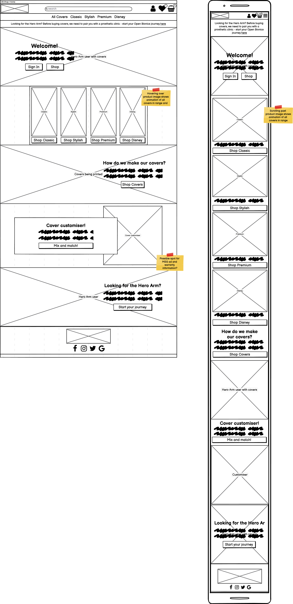

python3 manage.py migrate
python3 manage.py runserver

# OB Covers

## Code Institute: Milestone Project 4

I have worked for Open Bionics since 2016 - we are a medical engineering company that uses a combination of digital scanning and 3D printing to manufacture prosthetics. The main product - the Hero Arm - is a fully functional, bespoke prosthetic arm but our users can also customise their devices with a wide range of cover choices that come in different colours and styles. The current website that we use to sell covers hasn't been updated since 2018 and the backend is difficult to edit for anyone without software development knowledge - as a result, the user experience when using the website is poor, the product range is out of date and our cover sales are low. I wanted to develop a website - _OB Covers_ - with an easy-to-use backend that would make it easier for our customer base to purchase additional covers and hopefully boost cover sales.

This was the final of four Milestone Projects required to pass the Full Stack Web Development Program at _Code Institute_. The main requirements were to build a full-stack site based around business logic to control a centrally-owned dataset using HTML, CSS, JavaScript, Python and Django.

Click **[here](https://github.com/zoet24/ob-covers)** to view the Github repository for the project, and click **[here](#)** to view the live website.

## Table of Contents

- [UX Design](#ux-design)
    - [Design Process](#design-process)
        - [Strategy Plane](#strategy-plane)
        - [Scope Plane](#scope-plane)
        - [Structure Plane](#structure-plane)
        - [Skeleton Plane](#skeleton-plane)
        - [Surface Plane](#surface-plane)
    - [Information Architecture](#information-architecture)
    - [Features](#features)
        - [Existing features](#existing-features)
        - [Defensive design features](#defensive-design-features)
        - [Features left to implement](#features-left-to-implement)
- [Technologies Used](#technologies-used)
    - [Languages and frameworks](#languages-and-frameworks)
    - [Additional tools used](#additional-tools-used)
- [Git Commit Messages](#git-commit-messages)
- [Testing](#testing)
- [Deployment](#deployment)
- [Credits](#credits)

## UX Design
### Design Process
#### Strategy Plane

I started the design process for _OB Covers_ by considering the goals of the developer (me), the site owner (the sales team at Open Bionics) and the site users (our current customer base and prospective future customers) and categorised them into groups of functionality.

_**General**_

1. As the developer, I want to create a full-stack e-commerce platform where site users can browse and purchase products and where site owners can add, edit and delete products to complete the fourth Code Institute Milestone Project.
2. As the developer, I want the website to function well to demonstrate my ability to code in JavaScript, Python and Django and to create a positive UX experience for the site users.

_**Aesthetic, Branding and UX**_

3. As the developer, I want the website to be aesthetically pleasing and easy to use to demonstrate my ability to code in HTML and CSS and to create a positive UX experience for the site users.
4. As the site owner, I want the aesthetic of the website to match our existing brand to adhere to our established brand identity.
5. As the site owner, I want the site users to have a positive UX experience while browsing the product range to increase the likelihood of making a sale.
6. As the site owner, I want to be able to advertise new products or deals to our customer base to increase the likelihood of making a cover sale.
7. As the site owner, I want to promote our main product to increase the likelihood of making a Hero Arm sale.
8. As a site user, I want feedback when I successfully/unsuccessfully complete an action on the website.

_**Registration and User Accounts**_

9. As a site user, I want to be able to easily register for an account.
10. As a site user, I want to be able to easily log in and log out of my account.
11. As a site user, I want to be able to recover my password and log in details if I’ve forgotten them.
12. As a site user, I want to have a personalised profile page so I can save my delivery details and see what I have ordered in the past.
13. As a site user, I want to be able to easily report an issue with my product if it arrives damaged or if it breaks while I’m using it.
14. As a site user, I want to receive a confirmation email when I create a new account to confirm my details.

_**Viewing and Navigation**_

15. As the site owner, I want it to be easy for a site user to navigate to our main website in case they have come to OB Covers by mistake.
16. As a site user, I want to be able to view a list of products to select some to purchase.
17. As a site user, I want to be able to view specific product details (price, description, warranty) to inform my decision.
18. As a site user, I want to be able easily identify deals to take advantage of special savings.
19. As a site user, I want to be able to easily identify any "low stock" items so I can make my purchase before they run out.
20. As a site user, I want to be able to easily identify any "out of stock" items that I won’t be able to buy, so I don’t waste time trying to buy them.
21. As a site user, I want to be able to easily identify "newly added" products in case I am interested in purchasing them.
22. As a site user, I want to be able to view my selection of products and see how much they will cost to avoid spending too much.

_**Sorting and Searching**_

23. As a site user, I want to be able to customise my product to match my specific style.
24. As a site user, I want to be able sort products based on name, price, type, colour and brand.
25. As a site user, I want to be able to search for products based on name and description.

_**Purchasing and Checkout**_

26. As a site user, I want to be able to easily adjust the quantity of products from my shopping cart to reflect what I actually want to buy.
27. As a site user, I want to be able to save products that I might buy in the future but don’t want to buy immediately.
28. As a site user, I want to be able to easily enter my payment and delivery details so I can check out quickly with no hassle.
29. As a site user, I want to be confident that my payment information is safe and secure.
30. As a site user, I want to see an order confirmation after I pay to ensure I haven’t made any mistakes.
31. As a site user, I want to receive a confirmation email when I place an order to confirm my details.

_**Admin**_

32. As a site owner, I want to be able to add products when we add new designs to our product range.
33. As a site owner, I want to be able to edit products when our product range changes.
34. As a site owner, I want to be able to delete products when we remove them from our product range.
35. As a site owner, I want products to automatically update to "out of stock" if we don’t have any in our inventory to prevent customers from placing orders we can’t fulfill.
36. As a site owner, I want to be able to temporarily mark products as "new" when new products are added to our range.
37. As a site owner, I want to be able to temporarily mark products as "unavailable" if there is an issue with supply.
38. As a site owner, I only want Hero Arm users to be able to buy covers - customers who don’t currently have a Hero Arm should **not be able** to make a purchase.

#### Scope Plane

_**"Must-haves"**_

_**"Nice-to-haves"**_

#### Structure Plane

#### Skeleton Plane

#### Surface Plane

### Information Architecture

### Features
#### Existing features

#### Defensive design features

#### Features left to implement

## Technologies used
### Languages and frameworks

### Additional tools used

## Git Commit Messages

## Testing
Click **[here](readme-testing.md)** to view the complete testing process.

## Deployment
vid#1
- go to heroku website, name app and choose region closest to you
- provision a new postgres database, use free plan
- go back to gitpod to install dj database url and psycopg2 (using pip3)
- freeze requirements.txt to ensure heroku installs all requirements on deployment
- import dj database to settings.py
- comment out default database settings and replace default with a call to dj database
- give it database url for heroku (command line heroku config/environment variables)
- connect to heroku database and run migrations
- import all product data by loading in categories, and then products
- give yourself a superuser to log in to the admin with
- before you commit changes, remove database url and un-comment out default to prevent url ending up in version control
vid#2
- set up if statement to connect to postgres/sql lite
- install gunicorn and freeze that into requirements
- create procfile to tell heroku to run app
- temporarily disable collect static
- add host name of heroku app to allowed hosts in settings.py
- add local host so app still works with gitpod too
- git push and git push heroku master to deploy to heroku
- set auto deploy - connect to github through heroku and connect to repository
- generate django secret key and add to config vars on heroku
- change settings.py to get new secret key from environment
- set debug to true only when in development defined in environment
- naviagte to heroku to check auto deployments are working
vid#3
- AWS account

## Credits

__Code:__
I used the following snippets of code for...

__Acknowledgements:__
I'd like to thank...