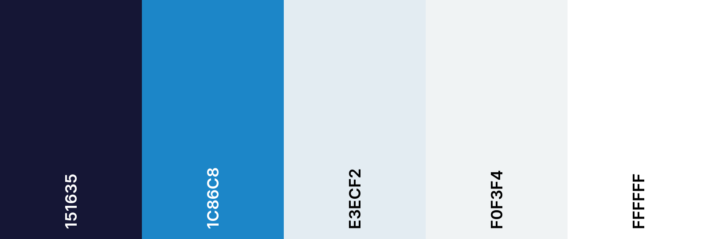

# Open Bionics Covers

## Code Institute: Milestone Project 4


I have worked for Open Bionics since 2016 - we are a medical engineering company that uses a combination of digital scanning and 3D printing to manufacture prosthetics. The main product - the Hero Arm - is a fully functional, bespoke prosthetic arm but our users can also customise their devices with a wide range of cover choices that come in different colours and styles. The current website that we use to sell covers hasn't been updated since 2018 and the backend is difficult to edit for anyone without software development knowledge - as a result, the user experience when using the website is poor, the product range is out of date and our cover sales are low. I wanted to develop a website - _Open Bionics Covers_ - with an easy-to-use backend that would make it easier for our customer base to purchase additional covers and hopefully boost cover sales.

This was the final of four Milestone Projects required to pass the Full Stack Web Development Program at _Code Institute_. The main requirements were to build a full-stack site based around business logic to control a centrally-owned dataset using HTML, CSS, JavaScript, Python and Django.

Click **[here](https://github.com/zoet24/ob-covers)** to view the GitHub repository for the project, and click **[here](https://ob-covers.herokuapp.com/)** to view the live website. Admin credentials and/or demo available upon request.

To test the payment transaction process please use:
- **Credit card number:** 4242 4242 4242 4242
- **Expiration date:** 04/24
- **CVC:** 242
- **ZIP** 42424

## Table of Contents

- [UX Design](#ux-design)
    - [Design Process](#design-process)
        - [Strategy Plane](#strategy-plane)
        - [Scope Plane](#scope-plane)
        - [Structure Plane](#structure-plane)
        - [Skeleton Plane](#skeleton-plane)
        - [Surface Plane](#surface-plane)
    - [Information Architecture](#information-architecture)
    - [Features and Django Apps](#features-and-django-apps)
        - [Existing features](#existing-features)
        - [Defensive design features](#defensive-design-features)
        - [Features left to implement](#features-left-to-implement)
- [Technologies Used](#technologies-used)
    - [Languages and frameworks](#languages-and-frameworks)
    - [Additional tools used](#additional-tools-used)
- [Git Commit Messages](#git-commit-messages)
- [Testing](#testing)
- [Deployment](#deployment)
    - [Deploying to Heroku](#deploying-to-heroku)
    - [Setting up AWS](#setting-up-aws)
    - [Setting up Automated Emails](#setting-up-automated-emails)
- [Credits](#credits)

## UX Design
### Design Process
#### Strategy Plane

I started the design process for _Open Bionics Covers_ by considering the goals of the developer (me), the site owner (the sales team at Open Bionics) and the site users (our current customer base and prospective future customers) and categorised them into groups of functionality.

_General_

1. As the developer, I want to create a full-stack e-commerce platform where site users can browse and purchase products and where site owners can add, edit and delete products to complete the fourth _Code Institute_ Milestone Project.
2. As the developer, I want the website to function well to demonstrate my ability to code in JavaScript, Python and Django and to create a positive UX experience for the site users.

_Aesthetic, Branding and UX_

3. As the developer, I want the website to be aesthetically pleasing and easy to use to demonstrate my ability to code in HTML and CSS and to create a positive UX experience for the site users.
4. As the site owner, I want the aesthetic of the website to match our existing brand to adhere to our established brand identity.
5. As the site owner, I want the site users to have a positive UX experience while browsing the product range to increase the likelihood of making a sale.
6. As the site owner, I want to be able to advertise our cover product range and clearly present what we have in stock to our customer base to increase the likelihood of making a cover sale.
7. As the site owner, I want to promote our main product to increase the likelihood of making a Hero Arm sale.
8. As a site user, I want feedback when I successfully/unsuccessfully complete an action on the website.

_Registration and User Accounts_

9. As a site user, I want to be able to easily register for an account.
10. As a site user, I want to be able to easily log in and log out of my account.
11. As a site user, I want to be able to recover my password and log in details if I’ve forgotten them.
12. As a site user, I want to have a personalised profile page so I can save my delivery details and see what I have ordered in the past.
13. As a site user, I want to receive a confirmation email when I create a new account to confirm my details.

_Viewing and Navigation_

14. As the site owner, I want it to be easy for a site user to navigate to our main website in case they have come to _OB Covers_ by mistake.
15. As a site user, I want to be able to view a list of products to select some to purchase.
16. As a site user, I want to be able to view specific product details (price, description) to inform my decision.
17. As a site user, I want to be able to easily identify deals to take advantage of special savings.
18. As a site user, I want to be able to easily identify any "low stock" items so I can make my purchase before they run out.
19. As a site user, I want to be able to easily identify any "out of stock" or "unavailable" items that I won’t be able to buy, so I don’t waste time trying to buy them.
20. As a site user, I want to be able to easily identify "newly added" products in case I am interested in purchasing them.
21. As a site user, I want to be able to view my selection of products and see how much they will cost to avoid spending too much.

_Sorting and Searching_

22. As a site user, I want to be able to customise my product to match my specific style.
23. As a site user, I want to be able sort products based on name, price, type, colour and brand.
24. As a site user, I want to be able to search for products based on name and description.

_Purchasing and Checkout_

25. As a site user, I want to be able to easily adjust the quantity of products from my shopping basket to reflect what I actually want to buy.
26. As a site user, I want to be able to save products that I might buy in the future but don’t want to buy immediately.
27. As a site user, I want to be able to easily enter my payment and delivery details so I can check out quickly with no hassle.
28. As a site user, I want to be confident that my payment information is safe and secure.
29. As a site user, I want to see an order confirmation after I pay to ensure I haven’t made any mistakes.
30. As a site user, I want to receive a confirmation email when I place an order to confirm my details.

_Admin_

31. As a site owner, I want to be able to add products when we add new designs to our product range.
32. As a site owner, I want to be able to edit products when our product range changes.
33. As a site owner, I want to be able to delete products when we remove them from our product range.
34. As a site owner, I want to be able to temporarily mark products as "new" when new products are added to our range.
35. As a site owner, I want to be able to temporarily mark products with deals if we are running a promotion.
36. As a site owner, I want to be able to temporarily mark products as "unavailable" if there is an issue with supply.
37. As a site owner, I want users to be unable to purchase "unavailable" products that we won't be able to fulfil.

#### Scope Plane

I used my user stories to create a list of "must-have" features which I organised using the same categories as above. I also made a "nice-to-have" list of features that I could include after completing the MVP if I had time.

_**"Must-haves"**_

_Aesthetic, Branding and UX_

1. The site must be aesthetically pleasing across all platforms and create a positive UX experience for all users.
2. The aesthetic of the site must match the current branding of Open Bionics.
3. The site must provide the user with positive/negative feedback whenever they complete an action on the site (eg. add a product to their basket, sign up for a new account).

_Registration and User Accounts_

4. The site must allow users to create an account that they can log in and out of.
5. The site must confirm the details of the user's account in an email after they have registered, and allow them to recover their log in details in an email if they have forgotten them.
6. The user's account must be personalised with their delivery details and order history.

_Viewing and Navigation_

7. The site must have clear navigation to the main Open Bionics website to redirect users who are looking for the Hero Arm.
8. The site must have a variety of clearly displayed products for the user to look through, with product details that are accessible by clicking on the specific product.
9. The site must have an easily accessible shopping basket that displays what the user has selected for purchase and how much it will cost them.
10. The site must have an easily accessible wish list that users can save products in for future purchase.

_Sorting and Searching_

11. The site must allow users to filter and sort products based on name, price, type, colour and brand.
12. The site must allow users to search for products based on name and description.

_Purchasing and Checkout_

13. The site must allow users to easily adjust and remove items from their shopping basket.
14. The site must allow users to save items for purchase at a later date in their wish list.
15. The site must allow users to move items from their shopping basket to their wish list and vice versa.
16. The site must not allow users to purchase "unavailable" items.
17. The site must allow users to input their delivery and payment information easily and not create unnecessary hassle at the checkout.
18. The site must present the user with a confirmation of their order after they pay and send them details of their order in a confirmation email.

_Admin_

19. The site must allow admin users to add, edit and delete products and mark them as "unavailable", both on the frontend of the site and on the admin backend.

_**"Nice-to-haves"**_

1. The site could have spaces to advertise new products, deals and promotions for the Hero Arm.
2. The user's account could be personalised with additional details (photos of them wearing the products that could be used to generate social media content, link to the Open Bionics App etc).
3. The site could allow users to report issues about their orders and Hero Arm.
4. The site could allow users to customise the colours of their covers (ie. instead of buying a full set of one colour, they could mix and match multiple colours).
5. The site could have a more advanced search filter for the products instead of the basic template shown on the Boutique Ado mini project.
6. The site could allow admin users to mark products as "newly added" or "discounted" depending on current promotions.
7. The site could have an inventory model that would automatically update items as "low stock" or "out of stock" depending on how many had been purchased.

#### Structure Plane

Based on the features outlined in my scope and the pages included in the _Code Institute_ Boutique Ado mini project, I decided I wanted to include the following pages on my website:

- The Home page welcomes the user to the site and presents the user with calls to action to explore the product range.
- There are five Products pages - "All Covers", "Classic", "Stylish", "Premium" and "Disney" - which show tiles of the products with name and price. Clicking on the product image takes you to the individual product page.
- Individual Product Detail pages show product image, name, price, colour options and description with buttons to increase/decrease desired quantity of covers, add them to the shopping basket or save them to the wish list.
- The Log In and Sign Up pages allow the user to log in to/create their profile so they can access their personalised information or request a new password.
- The Profile page has the user's saved delivery information and order history.
- The wish list and shopping basket are available across the site as a sidebar that expands when you click on the corresponding icon in the navbar. The wish list sidebar has the user's saved products with the option to add them to the basket. The shopping basket sidebar has the user's selected items with the option to increase/decrease the quantity, a total sum of the order cost and a link to the Checkout page.
- The Checkout page has a form for the user to enter their delivery information and a summary of their order on the right. When the user submits their order they are taken to an order confirmation page which shows them their order details and a link back to the main site.
- The Product Management page has a form that allows the admin user to add new products to the product range. The admin user can edit and remove products from the Product and Product Details pages.
- The navbar contains the Open Bionics logo which links to the Home page, a search bar which allows the user to search for products based on name and description, icons for the Profile page, wish list sidebar and shopping basket sidebar and links to all of the Products pages.
- The site provides the user with feedback on their actions in the form of a toast message at the top left of the screen - the toast message will be formatted differently depending on the content of the message.

#### Skeleton Plane
I used Balsamiq to develop wireframes (click **[here](readme-wireframes.md)** to view all of them) of what I wanted my website to look like on mobile and desktop. I kept my scope at the forefront of this design process to make sure that there was going to be a place to put all of my key features.


#### Surface Plane
After finishing my wireframes I started gathering Open Bionics media to start work on my surface plane. The Open Bionics colour scheme and logos are shown below - I used these throughout my design to match the aesthetic of the site with the Open Bionics branding. I also used the same 'Roboto' font that we use on the main Open Bionics website.




I also wanted to showcase all of the different cover designs on the Home page but didn't want to overcrowd the design with loads of images - I decided to design an interactive cover swatch that shows all of the different cover colours within a product range that the user can click through.

### Information Architecture
The product data is stored in 4 models - 1 main Product model and 3 smaller models for the Range, Style and Colour. The 3 smaller models are accessed using a foreign key value in the main Product model.

**Product model**
- SKU : Numerical identifier
- Name : Name of product
- Range : Foreign key to the Range model
- Style : Foreign key to the Style model
- Colour : Foreign key to the Colour model
- Description : Description of product
- Price : Price of product
- Image : Image of product
- Image URL : URL link to image of product
- Unavailable : Boolean to mark product available/unavailable

**Range model**
- Name : Name of range
- Friendly Name : Human readable name of range for rendering in templates

**Style model**
- Name : Name of style
- Friendly Name : Human readable name of style for rendering in templates

**Colour model**
- Name : Name of colour
- Friendly Name : Human readable name of colour for rendering in templates
- Hex colour : Hex value that controls the colour of the colour swatch displayed throughout the website
- Hex background : Hex value that controls the background colour of the cover image displayed throughout the website
- Hex border : Hex value that controls the colour of the border of the colour swatch displayed throughout the website

I initially considered modelling my product data using an inventory method - each product would have a stock level that would automatically decrease when a user placed an order, and could be used to flag products as "low stock" when the stock level dropped below a certain value, and "out of stock" when the stock level reached 0. However, I decided against this as all of our covers are bespoke and are made to order. Instead, I included an "unavailable" Boolean which admins can use to prevent users from buying certain products - this would be used in the event of a supply problem if we had run out of material to make a specific design, which is a more realistic scenario for our business.

### Features and Django Apps
_Open Bionics Covers_ is a Django project made up of 4 Django applications and a number of different additional features - I have listed them against the "must-have" features outlined in my scope to show how my project fulfils all of the project criteria, along with additional features outside of the scope, and illustrated these features with screenshots of from the desktop site.
#### Existing features
_Aesthetic, Branding and UX_

1. The site must be aesthetically pleasing across all platforms and create a positive UX experience for all users.
    - The site has a consistent colour scheme, iconography and branding across all pages. Hover effects are used to scale objects or underline links that can be clicked on. The interactive elements of the site (cover swatches, sidebars, filtering and sorting) perform well and react quickly. All of these factors combine to create a positive UX experience for the user.
2. The aesthetic of the site must match the current branding of Open Bionics.
    - The media images, product thumbnails and logos were all taken from Open Bionics archives and therefore represent the company brand accurately. Additionally, I have used a matching colour scheme and font type to our original shop website.
3. The site must provide the user with positive/negative feedback whenever they complete an action on the site (eg. add a product to their basket, sign up for a new account).
    - The toasts are the main source of user feedback - a message appears in the top left corner of the screen whenever a user completes a relevant action in a coloured and the colour of the message reinforces the tone of the feedback (green for success, blue for information, red for an error). Additional text reinforces the user's actions - if the user changes the quantity of items in their wish list or shopping basket this is displayed in a bubble above the icon in the navbar and in the sidebar; if the user performs a search or adds a filter to the products this is displayed in the breadcrumbs; if their search is unsuccessful they are notified on the products page.


_Registration and User Accounts_

4. The site must allow users to create an account that they can log in and out of.
    - The Django allauth plug-in provides users with secure registration functionality.
5. The site must confirm the details of the user's account in an email after they have registered, and allow them to recover their log in details in an email if they have forgotten them.
    - The Django allauth plug-in provides the functionality to send users emails containing their registration details after they sign up for an account, and their details if they can't remember them.
6. The user's account must be personalised with their delivery details and order history.
    - The user's Profile page allows them to save their delivery details which auto populate the Checkout page when they place a new order; it also displays tiles of their previous orders which can be clicked on to view the full details.


_Viewing and Navigation_

7. The site must have clear navigation to the main Open Bionics website to redirect users who are looking for the Hero Arm.
    - There is a permanent banner at the top of every page redirecting the user back to the Open Bionics main website. There is also a link at the bottom of the Home page.
8. The site must have a variety of clearly displayed products for the user to look through, with product details that are accessible by clicking on the specific product.
    - The user can view the full range of products or a filtered view using the navigation links in the navbar, or applying them on the main Products page. Individual products are displayed as cover tiles with a product image, name and price, and can be clicked on to access the full product details.
9. The site must have an easily accessible shopping basket that displays what the user has selected for purchase and how much it will cost them.
    - The shopping basket is available as a sidebar which can be accessed from every page on the navbar. The selected products are displayed in the sidebar with a breakdown of the price and how much extra they need to spend for free delivery. The total number of products in the basket are also shown as a number above the icon on the navbar.
10. The site must have an easily accessible wish list that users can save products in for future purchase.
    - The wish list is available as a sidebar which can be accessed from every page on the navbar. The selected products are displayed in the sidebar with a breakdown of the price; a cover swatch of all of the available colours is also displayed next to the product information. The total number of products in the wish list are also shown as a number above the icon on the navbar. Currently the contents of the wish list is only session based - if a user closes their session the contents of the wish list is erased. In future iterations of the site I would like to build a "bag contents" model which would save the contents of the user's bag and wish list from session to session.


_Sorting and Searching_

11. The site must allow users to filter and sort products based on name, price, type, colour and brand.
    - Users can filter products based on range, style, colour and availability, or sort products by name, price and colour. These filters are reflected in the breadcrumbs element and the total number of products in a specific filter or search criteria are displayed in brackets after the text.
12. The site must allow users to search for products based on name and description.
    - Users can enter search criteria in the search bar in the navbar. These search criteria are reflected in the breadcrumbs element. Results are displayed on the products page; if there are no search results a message is displayed asking the user to change their search criteria.


_Purchasing and Checkout_

13. The site must allow users to easily adjust and remove items from their shopping basket.
    - The user can adjust the quantity of the products in their basket without leaving the sidebar. Users can remove product from the basket, or add it to the wish list for later.
14. The site must allow users to save items for purchase at a later date in their wish list.
    - Users can add products from their basket straight to the wish list, or add products to the wish list from the Product Details page. 
15. The site must allow users to move items from their shopping basket to their wish list and vice versa.
    - See points 13 and 14.
16. The site must not allow users to purchase "unavailable" items.
    - Products that are "unavailable" are clearly marked with a tag and a fainter product thumbnail. The user can look at the product details but will not be able to add the product to their shopping basket, either from the Product Details page or their wish list. If the product is already in their shopping basket when it is made unavailable, the user will not be able to proceed to checkout. If the user is on the Checkout page and a product is made unavailable, it will be removed from their order when they make their payment.
17. The site must allow users to input their delivery and payment information easily and not create unnecessary hassle at the checkout.
    - Users can enter their delivery and payment information with a user-friendly form at the Checkout page. Users with an account can also save this information for future purchases and update this on their Profile page if it changes.
18. The site must present the user with a confirmation of their order after they pay and send them details of their order in a confirmation email.
    - The site sends users a confirmation email after the order has successfully gone through with all of their order details. A summary of their order can also be accessed from their Profile page.


_Admin_

19. The site must allow admin users to add, edit and delete products and mark them as "unavailable", both on the frontend of the site and on the admin backend.
    - Admin users can add new products from the product management dropdown menu. Admin users can edit or delete a product from its thumbnail, product detail page or Django backend. 


_Additional features_

- The onload fading animation that happens over the hero image on the home page (and the signup and log in pages) only happens the first time a user visits that page. On the first visit the onload function saves a "visited" variable to the session to prevent the user from having to sit through the animation every time they visit that page.
- The interactive cover swatches engage the user and allow them to browse the full product range from the home page, before deciding what product range to explore. The colours for the swatch, swatch border and corresponding background colour are adjustable on the Django admin panel, and are customisable for special designs like the Disney range.

#### Defensive design features
I implemented a number of defensive design features throughout my code to protect the site against malicious use and to further improve the user experience. The main ones are:
- Designing custom 404 and 500 error pages - this provides the user with an easy route back to a non-problematic page via the navbar in the event of an error.
- I used the @login_required decorator to restrict adding, editing and deleting products to admin users - if a user tries to navigate to those pages through the URL they are redirected to the homepage and receive an error toast message.
- The cover swatches function in ob_covers/contexts.py eliminates duplicate colours being added to the same swatch which prevents the swatches rendering with too many values.
- There are multiple defensive blocks to prevent users placing orders for unavailable items. Products that are "unavailable" are clearly marked with a tag and a fainter product thumbnail. The user can look at the product details but will not be able to add the product to their shopping basket, either from the product details page or their wish list. If the product is already in their shopping basket when it is made unavailable, the user will not be able to proceed to checkout. If the user is on the checkout page and a product is made unavailable, it will be removed from their order when they make their payment.
- If a user tries to add a product to their shopping basket that they already have a quantity of, it will add one more product to the total instead of creating another tile which wouldn't be aesthetically pleasing; if a user tries to add a product to their wish list and they already have it in there, a toast error message will inform them that this is the case.
- If an admin user tries to delete a product from the inventory while it is in their wish list or shopping basket, the delete function will pop the item out of the session to avoid throwing an error.
- The vital fields on all user forms (eg. name and email for users, name and description for products) are required in the models to ensure that the information submitted can actually be used. All relevant fields also have max lengths to prevent overly long text being submitted.

#### Features left to implement
My final project fulfils all of the "must-have" criteria in the scope but if I had more time/came back to this project in the future there are still some features I would like to implement.

_Functionality_
- The functionality for applying multiple filters to the product range is there (ie. if you add ?range=classic&colour=black to the /products/ URL it will return all black covers in the Classic range) but I didn't have time to create the user interface for applying multiple criteria. Changes would need to be made to the breadcrumbs, the current filter/sorting bubbles and the no results message if the user combined a set of incompatible filters. 
- The site could allow users to report issues about their orders and Hero Arm through a contact form or a link to a live chat feed.
- The site could allow users to customise the colours of their covers (ie. instead of buying a full set of one colour, they could mix and match multiple colours) - this would require a customiser widget and a full rework of the product structure.
- The site could allow admin users to mark products as "newly added" or "discounted" depending on current promotions - this would build on the functionality used for the "unavailable" tag.
- The site could have an inventory model that would automatically update items as "low stock" or "out of stock" depending on how many had been purchased - as mentioned in my Information Architecture section I chose to not use this structure due to the nature of our business, but if we added more products to our range (eg. Open Bionics t-shirts, add-ons for the Hero Arm) then it would make sense to implement this.
- I would like to add in the functionality for users to leave reviews and ratings for the products they had purchased.
- I would like to add in a recommendation system that would suggest specific products to users who had made previous purchases.
- The race condition between the order form and the webhook handler occasionally creates duplicate orders for the user - when the order isn't created quickly enough by the form the webhook handler assumes an error has occurred and creates the order based on the webhook from Stripe, but then soon after the form finishes processing and creates the order again. This could be fixed by increasing the number of attempts in the `handle_payment_intent_succeeded` function or the delay between attempts, but this would potentially slow down the checkout process (and wouldn't guarantee that this bug would be eliminated!) I discovered this bug very close to my submission deadline so didn't have time to fix it but in the event Open Bionics opt to use my site fixing this bug would be a priority.
- Currently the contents of the wish list is only session based - if a user closes their session the contents of the wish list is erased. In future iterations of the site I would like to build a "bag contents" model which would save the contents of the user's bag and wish list from session to session.

_Defensive design_
- Currently when an admin user chooses to delete a product from the site there is no double check on whether they meant to do this - I would like to add a modal that pops up when the delete button is selected that asks "Are you sure you want to delete this?"
- Currently when a product is deleted from the inventory it will be removed from any order confirmations that had a quantity of that product in it. While this is not user friendly, deleting the product does not cause the site to crash so I decided it was out of the scope of the project to fix this. In the event Open Bionics opt to use my site, fixing this bug would be a priority.

_UX_
- I would like to write a JavaScript function that would close the navigation and toast elements just by clicking outside the menu instead of having to click on the close button.
- I would like to add in a hover effect over the cover tiles on the products page that would allow users to add the product straight to their wish list or basket instead of going via the product detail page. Similarly I'd like to add a "straight to checkout" button on the product detail page so they wouldn't have to go via their shopping basket.
- There is a small visual bug on the products menu on desktops - the user can scroll the filter menu past the footer. I ran out of time to fix this, but the menu retains its functionality so I didn't think it was critical to fix for project submission.

_Content_
- There are a lot of features that could be added to the user's profile to make it more interactive for them, such as links to social media or contact details to our customer support team in case there is a problem with their order. I would also like to implement more of the allauth functionality, such as allowing the user to update their username and password from their account.
- In the event that Open Bionics opt to use my site there are a lot of areas to build in promotions for the Hero Arm or new cover ranges.
- I left out static pages like a blog, FAQs and a contact form as I wanted to focus on the more complex Django functionality, but adding these would improve the user experience.

## Technologies used
### Languages and frameworks
- HTML: The language used to create the content and structure of my project.
- CSS: The language used to style the HTML5 elements to create the aesthetic of my site.
- JavaScript and JQuery: One of the languages used to add extra functionality to my site.
- Python: The language used to write the logic that controls my site.
- Bootstrap framework: I used the Bootstrap grid system to make my site responsive on different devices. I also used it for the carousel and modal components throughout the site.
- Django: A high-level Python web framework used to control my site.
- Heroku: I used Heroku to deploy my project and make it viewable to others.
- SQLite: The default database used in Django development.
- PostgreSQL: The production database used through Heroku.
- AWS S3: I used AWS for hosting media and static files on the Cloud.
- GitHub: I used GitHub to store my source code and repository.
- Gitpod: I used Gitpod's development environment to write the code for my project.

### Additional tools used
- Amiresponsive: I used this to produce the main image for my readme file and to test the responsiveness of my website.
- Balsamiq: I used this to produce wireframe sketches for the site's skeleton plane.
- CompressPNG: I used this to compress the static images to improve performance.
- FontAwesome: I used FontAwesome's database for basic icons throughout my site.
- FreeFormatter: I used Freeformatter.com to format my code properly.
- Google Developer Tools: I used this to test the responsiveness of my website by viewing my project on devices with different screen sizes. I also used the Console to test different functions in my JavaScript code throughout development, and the Lighthouse package to test the performance of the site.
- JSHint: I used this to test the validity of my JavaScript and JQuery code.
- Lighthouse:
- PEP8Online: I used this to test the compliance of my Python code.
- Stripe: I used Stripe to manage the test payment transactions.
- W3C CSS Validation Service: I used this to test the validity of my CSS code.
- W3C Markup Validation Service: I used this to test the validity of my HTML5 code.

## Git Commit Messages
I continued using the git commit format style that I had developed during my other Milestone projects. I used the imperative tense for all messages; I referred to all pages with their full name (ie. index.html instead of index); I denoted bug fixes by including "Bug" at the start of the message; all messages were under 50 characters. I've included 10 git commit messages below to demonstrate the syntax.
- **1bc8284** 2021-04-13 - Finish adding basic content to shopping basket
- **afeaa1e** 2021-04-13 - Bug fix: Add extra JS file for quantity adjustment in shopping basket
- **b4dc59b** 2021-04-13 - Add contexts and views for add to favourites functionality
- **2e78fe4** 2021-04-13 - Add remove functionality to favourites menu
- **9c5906a** 2021-04-13 - Add bag to favourites functionality to shopping basket menu
- **2bc1084** 2021-04-13 - Add favourites to bag functionality to favourites menu
- **3c87df4** 2021-04-13 - Make migrations for assigning colours rgb values
- **e75cb83** 2021-04-14 - Migrate changes to store hex codes for cover swatches in django
- **5762caa** 2021-04-14 - Streamline cover swatch code and remove css styling
- **238b53f** 2021-04-14 - Remove visual errors with new cover swatch code

## Testing
Click **[here](readme-testing.md)** to view the complete testing process.

## Deployment
### Deploying to Heroku
Deploy the site to Heroku using the following steps:
1. Create a `requirements.txt` file
    - Enter `pip freeze > requirements.txt` in the terminal
2. Create a `Procfile`
    - Enter `pip3 install gunicorn`
    - Create a `Procfile` in the root directory
    - Add `web: gunicorn ob_covers.wsgi:application` to the file
    - Add, commit and push your code to GitHub
4. Create a new app on Heroku
    - Sign in to the Heroku dashboard a create a new app by clicking "Create new app" in the "New" dropdown box
    - Choose a relevant and unique app name and choose the region closest to you
5. Add Postgres to Heroku
    - Go to the "Resources" tab and provision a new Heroku Postgres using the free plan
6. Set Heroku config variables
    - In the Config Vars add values for:
        - DATABASE_URL (your Postgres database URL)
        - SECRET_KEY (your secret key)
        - STRIPE_PUBLIC_KEY (your Stripe public key)
        - STRIPE_SECRET_KEY (your Stripe secret key)
        - STRIPE_WH_KEY (your Stripe webhook key)
        - USE_AWS (set to True)
7. Set up a new database in `settings.py`
    - Enter `pip3 install dj_database_url` and `pip3 install pyscopg2` in the terminal and then freeze your requirements again
    - In `settings.py` add `import dj_database_url` at the top
    - In `settings.py` temporarily comment out `DATABASES`
    - Add the following code with your Postgres database URL (DO NOT commit/push your code to GitHub while your Postgres URL is visible in your settings)
        ```
        DATABASES = {
            'default': dj_database_url.parse("<your Postrgres database URL>")
        }
        ```
    - Migrate your models to the Postgres database by entering `python3 manage.py makemigrations` and `python3 manage.py migrate` into the terminal
    - Load the data fixtures by entering `python3 manage.py loaddata ranges`, `python3 manage.py loaddata colours`, `python3 manage.py loaddata styles` and `python3 manage.py loaddata products` into the terminal
    - Create a superuser with admin rights by entering `python3 manage.py createsuperuser` into the terminal with an email, username and password
    - Correct the `settings.py` file by uncommenting the `DATABASES` and removing the code with your Postgres URL - your final database code should look like:
        ```
        if 'DATABASE_URL' in os.environ:
            DATABASES = {
                'default': dj_database_url.parse(os.environ.get('DATABASE_URL'))
            }
        else:
            DATABASES = {
                'default': {
                    'ENGINE': 'django.db.backends.sqlite3',
                    'NAME': os.path.join(BASE_DIR, 'db.sqlite3'),
                }
            }
        ```
    - In `settings.py` add the hostname of the Heroku app to `ALLOWED_HOSTS = ['localhost']`
    - Add, commit and push your code to GitHub
8. Set up automatic deployment to Heroku
    - In Heroku navigate to "Deploy" > "Deployment Method" > "Connect to GitHub"
    - Search for your repo and select it
    - Navigate to "Automatic Deployment" > "Enable Automatic Deploys"
    - Test that it is working by pushing your code and checking the Heroku app URL

### Setting up AWS
Host your static files and images with AWS using the following steps:
1. Set up an [AWS account](https://aws.amazon.com/)
2. Create an AWS S3 Bucket, a Bucket Policy, a Group, an Access Policy and a User using the instructions outlined [here](https://docs.aws.amazon.com/AmazonS3/latest/userguide/GetStartedWithS3.html)
3. Connect Django to S3 using the instructions outlined [here](https://django-storages.readthedocs.io/en/latest/backends/amazon-S3.html)
4. Add the AWS_ACCESS_KEY_ID and AWS_SECRET_ACCESS_KEY to your Heroku config variables

### Setting up Automated Emails
Set up automatic emails with Django and Gmail using the following steps:
1. Navigate to "Account Settings" > "Other Google Account Settings" > "Security"
2. Turn on 2-step verification
3. Navigate back to "Security" > "App passwords", select "Mail" in the app dropdown and then "Other" in the device dropdown
4. Copy the 16-character password and add it as EMAIL_HOST_PASS to your Heroku config variables
5. Copy the Gmail address and add it as EMAIL_HOST_USER to your Heroku config variables

## Credits
__Media:__ All of the images and logos on the website are property of Open Bionics.

__Code:__
This project was based off of the _Code Institute_ Boutique Ado mini project - portions of the code might remain similar to the tutorial but the majority of the project has been updated with my own work. I used Stripe's development tools to get the checkout process up and running, and relied heavily on Stack Overflow and the additional Django documentation throughout development. Any code that has been copied directly from an external source will have a comment beside it crediting the author.

__Acknowledgements:__
I'd like to thank my bosses Joel Gibbard and Samantha Payne for allowing me to use the Open Bionics images, logos and branding, and my colleagues for their useful feedback on the finished website. I'd also like to thank my tutor Can Sucullu, the _Code Institute_ community and my friends and family for their guidance and input on this project.